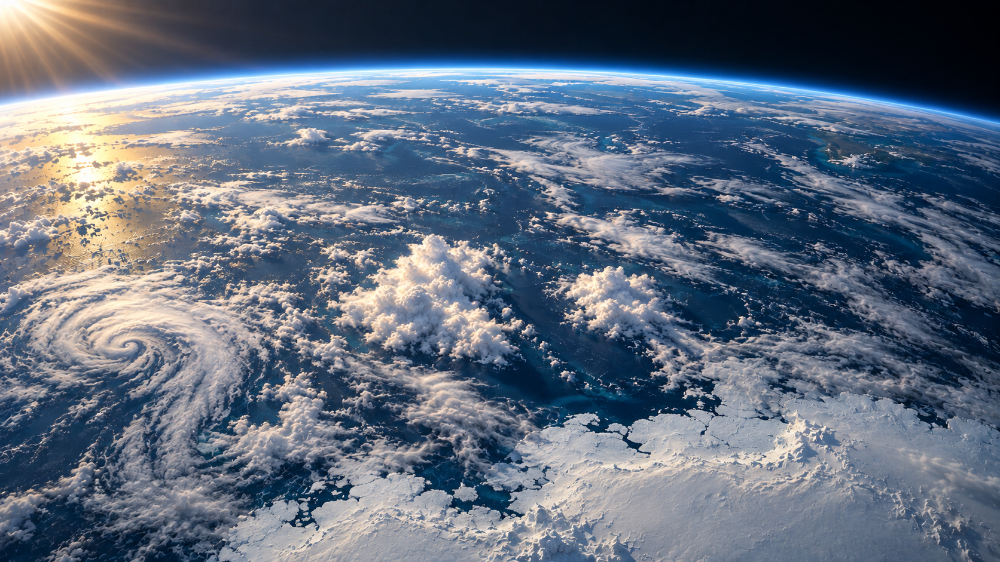
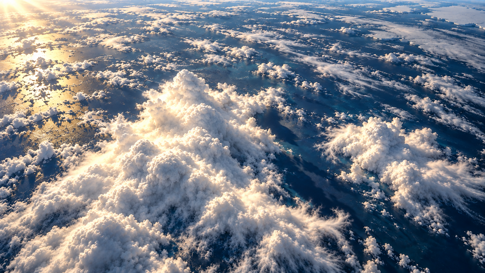
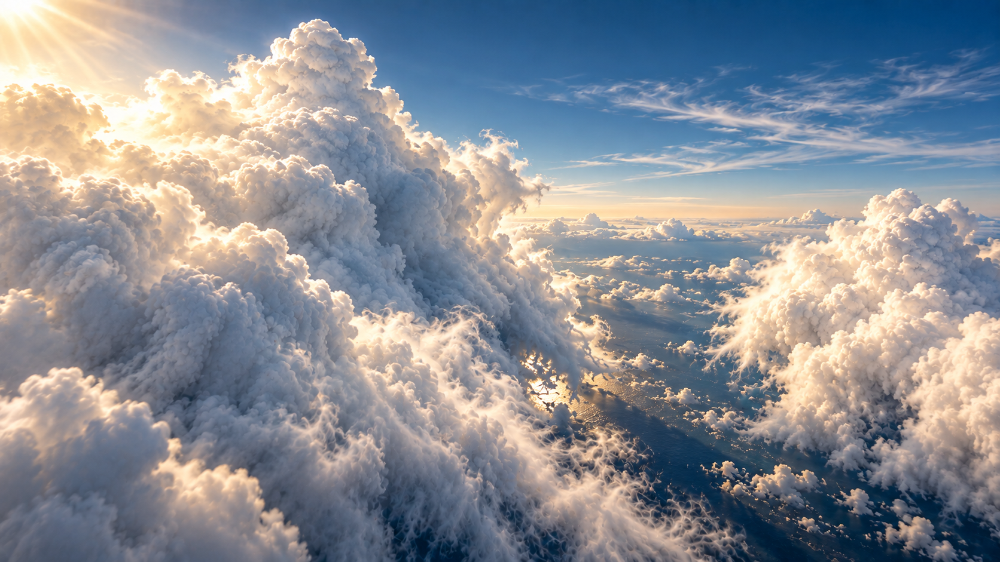
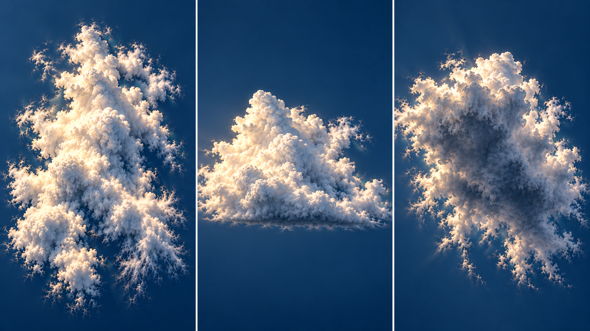
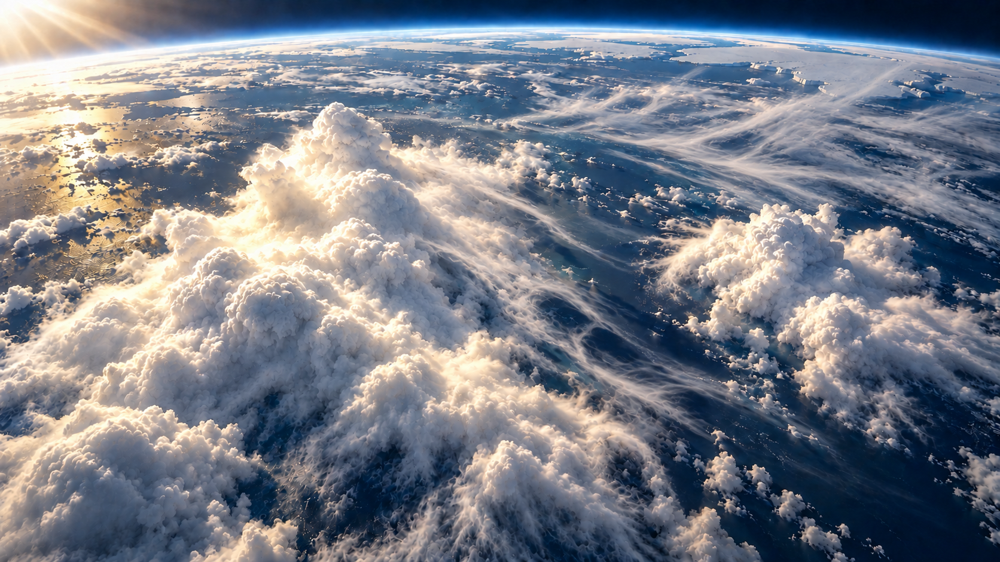

# A-P2 궤도 구름 목업 — 첫 5장 검토

연결: D-076/D-077 · 기존 A의 무드와 같은 군집을 확대하는 장면 목표.

**현재: 첫 묶음 제작·자체 검토 완료 / 사용자 검토 전 / 전체 목표 TUNE.** 이미지 생성 8회 = 첫5종 + 표면/시점 보완3회. 이번 결과는 built-in imagegen의 concept still이며, 실제 구름 자산·Cycles gold render·browser 구현·성능 검증은 별도다.

[전체 갤러리](../../../../../verification/a-cloud-mockup-20261006/gallery.html) · [실제 입력·출력 provenance](../../../../../verification/a-cloud-mockup-20261006/generations.json) · [전체12장 계획](ECG_A_orbit_cloud_reference_plan_2026-10-06.md)

## 1. 어떤 것부터 판단하면 되는가

1. **공간 구성:** 궤도에서 넓은 구름 분포를 본 뒤, 하강하면서 큰 왼쪽 군집과 작은 오른쪽 군집 사이 틈으로 향하는 흐름.
2. **조형·재료:** 불규칙한 큰 융기/중간 솜방울/가늘게 풀린 외곽이 서로 다른 규모로 보이는가. 단단한 얼음 표면과 구별되는가.
3. **빛:** 따뜻한 윗면, 차가운 홈과 옆면, 아래 바다 그림자로 양감이 느껴지는가.
4. **얇은 층:** 늘어진 섬유와 뒤가 비치는 영역이 두꺼운 구름과 구별되는가.

같은 구름을 정확히3D복원했는지, 고도/FOV/그림자위치가 물리적으로 일치하는지는 이 이미지로 확정하지 않는다. 이번에는 화면 목표와 남은 정합 문제를 분리해 판단한다.

## 2. 전이 프레임

### J2 궤도 — 광역 분포와 청색 수평선

- 구도: 수평선이 상단에 걸리고 바다·남극·광역 구름이 화면을 채운다. 중앙의 높은 군집과 오른쪽 작은 군집이 이후 접근 대상이다.
- **KEEP 후보:** 얇은 청색 rim, 따뜻한 왼쪽 빛, 다양한 규모의 광역 띠/patch/틈.
- **TUNE:** 지정했던250–400km/4km local bank 관계에 비해 주 군집이 크게 보인다. 생성 화면의 숫자를 실제camera값으로 채택하지 않는다. globefield와 주 군집의 크기를 gold scene에서 맞춰야 한다.

### J3 하강 — 목표 군집을 향하는 상부 사선 시점

- 구도: 지구 rim이 사라지고 바다 쪽으로 시야가 내려온다. 큰 군집·작은 군집·중앙 틈과 주변 cloud field를 함께 유지한다.
- **KEEP 후보:** 빈 하늘로 바뀌지 않는 인계 목표, 바다에 드리운 그림자, core/edge 밀도 대비.
- **TUNE:** 주 군집이 처음 요구한28–38%폭보다 크게 확대됐다. J2와의 정확한 지리/형상 대응은 미확인. J3→J5는 조형의 대략적인 연속성이지 실제 camera path 증거가 아니다.

### J5 v3 옆면 — 구름 사이로 들어가는 카메라

- 구도: 왼쪽 near sidewall을 크게 보고 오른쪽 군집 사이 틈으로 진행한다. 수평선은 구름 아래쪽에 있고 위쪽은 대기 sky다. J3보다 시선이 낮아져 깊은 옆면과 음영을 보게 된다.
- **KEEP 후보:** 큰/작은 군집의 앞뒤 관계, 옆면의 푸른 음영, 가늘게 풀린 가장자리, 통과할 gap.
- **TUNE:** 형태는 같은 계열이나 정확한동일mesh는 아니다. 상부 빛이 조금 더 따뜻해진 부분과 실제 태양방향/바다반사·그림자 정합은 같은world gold render에서 확인한다. flare를 quality 그 자체로 삼지 않는다.

## 3. 구름 상세 기준

### C1 v2 형태·윗면·옆면·아랫면 비교

- 목적: footprint/큰 융기·틈, 낮은 base와 높은 tower, 아랫면의 차가운 음영과 밝은 가장자리를 각각 읽는 **개념 형태 sheet**.
- 첫 시트는 세 구도가 비슷했고 crop/flare가 방해해 수정했다. v2에서 평면/옆면/아랫면 역할은 더 구분된다.
- **KEEP 후보:** 형태 규모, 흐트러진 edge, 밝은 윗면과 어두운 아래쪽의 대비.
- **TUNE:** 왼쪽은 정확한90° 정사영임을 검증할 수 없고 세panel의scale/shape도 엄밀히 같지 않다. 따라서 이 그림을 정확한top/side/bottom mesh blueprint로 사용하면 안 된다. 실제asset의같은camera 렌더3개로 나중에 교체한다.

### C2 두꺼운 층과 얇은 층의 겹침

- 목적: 두꺼운 불투명 billow와 길게 늘어진 thin filaments, 얇은 층 너머 바다/그림자를 함께 보여준다.
- **KEEP 후보:** 서로 다른 구름 모양, 투과 차이, 중앙 gap을 따라 겹치는 가는 층.
- **TUNE:** C2는 J5 v2 상부 사선 시점에서 파생했다. 최종J5 v3와 동일camera on/off 비교는 아니다. thin의앞/뒤가림 전체가 물리적으로 맞는지도 미확인이다. 내용은 광학목표로 사용하고 고정asset의같은camera depth검증은 별도다.

## 4. 수정 과정과 보존

| 회차 | 문제·조치 | 판정 |
|---|---|---|
| J5 v1→v2 | hard ice/cliff같은 fine surface를 vapor/billow/feather edge로 변경 | 구도유지/재료개선. v1은표면기준으로자체반려,원본보존 |
| C1 v1→v2 | 세시점이너무비슷하고crop/flare방해 → 방향/전체framing보완 | 개념비교TUNE,정확한3D멀티뷰증거아님 |
| J5 v2→v3 | J3와각도차이부족 → cloud높이의낮은side camera | 통과구도더분명. 이전v2는C2부모로보존 |

G6 자체품질 보완은3회 사용했다. 이 결과에서 남은 정합 문제를 이미지 생성 반복으로 숨기지 않는다. 화면·기하·광학·동작의 검증은 별도다.

## 5. 다음 순서

이번5장은 전체12장 계획의 첫 검토 단위다. **남은7항목은 J0/J1/J4/J6/J7/C3/C4**이며, J1/서고 도착 부분은 기존 만족 목업을 우선 재사용한다. 현재 그림에 대한 사용자피드백으로 원하는조형/카메라/빛을 고정한 후 그 anchor로 나머지전이를 채운다.

그 다음 actual scene에서같은world/camera/receiver/태양/단위의gold render를 만든다. 대규모 envelope+작은detail, direct/sky occlusion/지표shadow/대기합성을 분리한다. 고도·스케일·모든view의같은geometry는그때 검증한다. 지금 generated images를runtime texture로 바로쓰거나 D075후보를자동채택하지 않는다.

승인서고/기존실패기록/ECGclock은유지. A-P3, Story, B/C는별도후속. 이번에는renderer를수정하거나GPU/영상품질을새로검증하지않았다.

종료 검증: 8개 image pin/선택5종/갤러리 local 링크 PASS, 로컬 Vite 갤러리 HTTP200, records167 PASS, diff-check PASS. HTTP 응답은 브라우저 시각 검증을 뜻하지 않는다. 정확한 생성 입력과 출력을 프로젝트 안에 보존했다. commit/push 후 원격 readback으로 저장을 확인한다.
