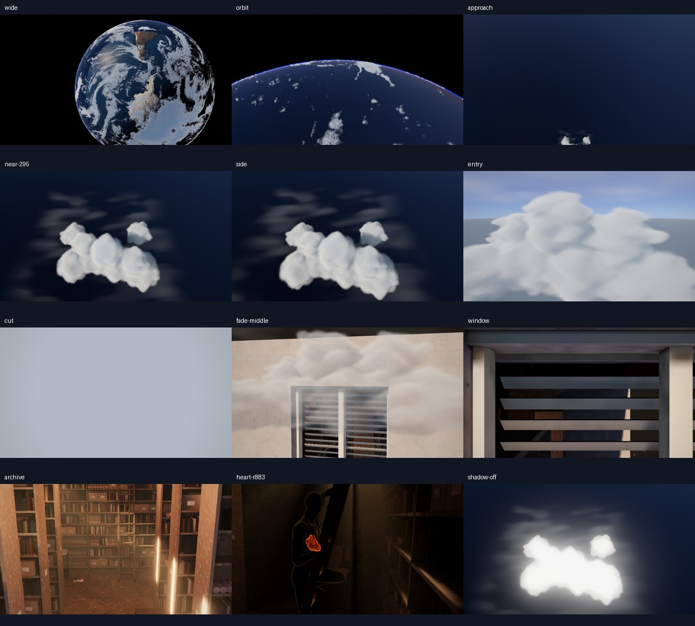

# A-P2 조형 구름 + 빛 깊이 bake 시험

연결: D-075 / F-046 / O-011 / CASE-007. 기존 D-074 실패 후보를 덮지 않는 새 시험이다.

## 1. 현재 판정

**부분 기능 검증 PASS / 목업 충실도 FAIL / 후보 TUNE / 기본 채택 보류.**

사용자의 두꺼운 불투명 구름·하부 그림자와 얇은 투과층을 별도로 제작했다. 둥근 융기와 음영은 더 읽히지만 가까운 화면에는 뭉툭한 면, 흐린 외곽, 빈 하늘이 남아 있다. 목업의 자연스러운 다중 군집·솜털·따뜻한 역광 수준에 도달하지 못했다. 새로운 shader 기능이나 Cycles 파일의 존재를 완성도 증거로 쓰지 않는다.

실험 주소: `http://127.0.0.1:4198/?cloudModel=sculpt`. 기본 v1과 이전 `cloudModel=layers`는 보존한다. 승인 서고 D-068 및 ECG 입력 데이터는 같은 자산/구조를 유지한다. A-P3, Story, B/C는 독립 후속으로 남는다.

## 2. 실제 제작한 자산과 표현

- 생성 script의 비대칭 타원체 171개/경계 침식으로 4×2×4km 국소 군집을 정의하고 128³ R8 밀도로 저장했다. 큰 융기, 작은 융기, 낮은 안장과 군집 사이 빈 공간을 나눴다.
- 같은 R8를 2D atlas로 포장하여 Blender volume bound의 Principled Volume 노드에 연결했다. packed `.blend`도 저장했다. **mesh→VDB 추출이나 고급 외부 구름 에셋 확보를 완료한 것은 아니다.** 편집 source는 script/manifest/노드 장면이다.
- 고정 궤도 태양 방향의 광학 깊이를 미리 적분했다. browser는 F16 light-depth/ground-depth를 읽는다. R8 깊이 시험은 양자화 비교 자료로 보존한다. 광원을 바꾸면 rebake가 필요하다.
- 근접 96 view samples + light lookup 1회, ground lookup 1회. 별도 얇은 층은 고층의 낮은 밀도와 늘어진·휘어진 noise로 표현했다. 투명 막을 복제한 구조가 아니다.
- 광역 cloud는 기존 v1을 사용하다 국소 군집으로 인계한다. scene-depth 가림, half-res HDR 및 공간 업스케일을 사용한다. 시간축 누적/TAA/STBN/적응 step은 아직 구현하지 않았다.

Cycles와 browser는 밀도 정의와 태양 방향을 공유한다. **카메라와 수광체는 동일하지 않다.** Cycles의 파란 평면은 조형/빛 확인용이며 실제 지구 곡면의 정확한 복제가 아니다. Principled Volume/AgX와 realtime 산란 근사/ACES도 다르다. Blender X/Y의 nearest atlas sampling과 browser trilinear sampling 차이도 있다. 따라서 6장의 Cycles 자료를 픽셀 일치 기준으로 제시하지 않는다. [Blender 공식 Principled Volume 설명](https://docs.blender.org/manual/en/4.4/render/shader_nodes/shader/volume_principled.html)은 밀도와 산란/흡수가 연결되는 근거다.

## 3. 회차와 결함 복구

| 구분 | 변경 | 결과/한계 |
|---|---|---|
| initial | 분리된 큰 융기, σ=1.8, bake | 부피가 약하고 반투명 덩어리 |
| tune1 | σ=12, 작은 융기 추가, 태양 방향 정합 | 불투명 core와 하부 음영이 분명해짐 |
| tune2 | 밀도 경계 침식, 얇은 층 조정 | 큰 매끈한 면은 여전히 남음 |
| tune3 | 얇은 층의 반복 밴드 억제, 좌표 warp/밀도 감소 | 강한 줄무늬 완화. 섬유 질감은 미달 |
| 기능 복구 | F16 깊이, 거리와 무관한 시선 방향 보간, fresh/역방향 가림 준비 | 정지 프레임의 접근/짧은 가림/서고 노출 확인. 연속 역스크롤 영상 검증은 별도 미완 |

G6 initial+3 품질 수정은 종료했다. 기존 후보의 수정을 추가 회차로 숨기지 않는다. 목표 품질이 부족한 상태에서 기본에 채택하지 않는다.

## 4. 실행 환경과 검증 범위

최종 실제 browser 프레임/상태는 `verification/a-cloud-sculpt-20261006/native-captures/sculpt-native-final/`에 저장했다. PNG는 **3D canvas만 포함**하고 DOM 제목/파형 overlay는 포함하지 않는다. 고정 p/t/frame12, grain off, 1920×1080 DPR1이다. URL harness와 loopback 전용 저장 endpoint는 spike QA에서만 사용한다.

이 브라우저의 renderer는 **Microsoft Basic Render Driver / ANGLE D3D11**, 즉 소프트웨어다. 화면/기능 증거이며 RTX 성능 증거가 아니다. CPU submission 수치를 GPU frame time으로 대체하지 않는다. 이전 RTX p95 18.49ms 및 실패 후보 40.03ms와 비교 가능한 새 수치는 없다.

Blender의 CUDA `cuInit Invalid value` 및 렌더 queue 오류가 발생했고, 최종 reference run은 GPU requested이지만 CPU만 열거됐다. GPU 렌더 성공으로 기록하지 않는다. CLI Chromium은 빈 canvas의 WebGL/WebGL2도 만들지 못했다. 앱 내 브라우저에서는 소프트웨어로 성공했으므로 “모든 browser가 불가능하다”는 초기 checkpoint를 정정했다. 구체적인 driver/권한 원인은 확정하지 않았다. 사용자 앱 종료·driver reset은 수행하지 않았다.

Cycles 최종 6장은 `cycles-final-reference`의 640×360/16samples/denoise 기준 자료다. 고해상도 최종 reference나 목업 동일 품질이 아니다. initial/tune1/resolved/nearest 진단 및 실패 CUDA/중단 run은 별도로 보존했다.

build PASS(56modules, main JS 약1.034MB), 새 npm 패키지 없음. 큰 chunk 경고 유지. 최종 지표와 source/asset pin은 `verification/a-cloud-sculpt-20261006/checkpoint.json` 및 `metrics.json` 참조. fixed-path 정역 영상/목표 GPU/600초/장시간 검증은 미실행이다. 앞선 후보의 runtime PASS를 새 후보 PASS로 상속하지 않는다.

## 5. 다음 판단과 순서

1. 현재 후보의 실패 원인을 화면 기준으로 선택: 분리 군집의 자연스러운 규모/실루엣, multi-scale edge detail, 밝은 윗면과 어두운 아랫면의 대비, 궤도→근접 카메라 연속성.
2. 새 품질 라운드는 **정합된 camera/receiver의 고품질 기준 렌더를 먼저** 확보해야 한다. 이번 조형은 목업 목표를 만족하는 기준 자체가 아직 아니다. 밀도 데이터를 공유했다는 이유로 renderer 튜닝만 계속하지 않는다.
3. 하드웨어 환경에서 동일 renderer/해상도/정역 경로 GPU timing과 영상 검증을 재개한다. software 결과로 비용 개선을 선언하지 않는다.
4. 해당 구름 품질과 경로를 확인한 뒤 A-P3로 넘어간다. Story 노이즈원/자세 제작을 이 실패 후보의 완료 처리에 섞지 않는다.

### 최종 정지 프레임 수치
16프레임 ready, 현재탭 콘솔 error0. p.55 기존서고 RGB차0(동일software/프레임12/무grain). R883: sample=rAbs883, beatAge0, heartScale1.07, sharedClock. .295 그림자off mean33.135RGB, thin off5.204RGB; 출력기여만 확인. bloomoff차0으로 조형미달은 bloom의 유무로 해결되지 않는다. 효과off는 bake를 다시 생성하지 않은 기여분리 진단이다. 전체경로16프레임은 연속 영상 검증을 대신하지 않는다.

종료 체크: records163 PASS / build56modules PASS / pycompile PASS / asset7pins PASS / diff-check PASS. commit 직전 원격 workbranch59ca1c50/maincfef4300 확인. 원격 저장은 push 후 readback으로 별도 확인.
